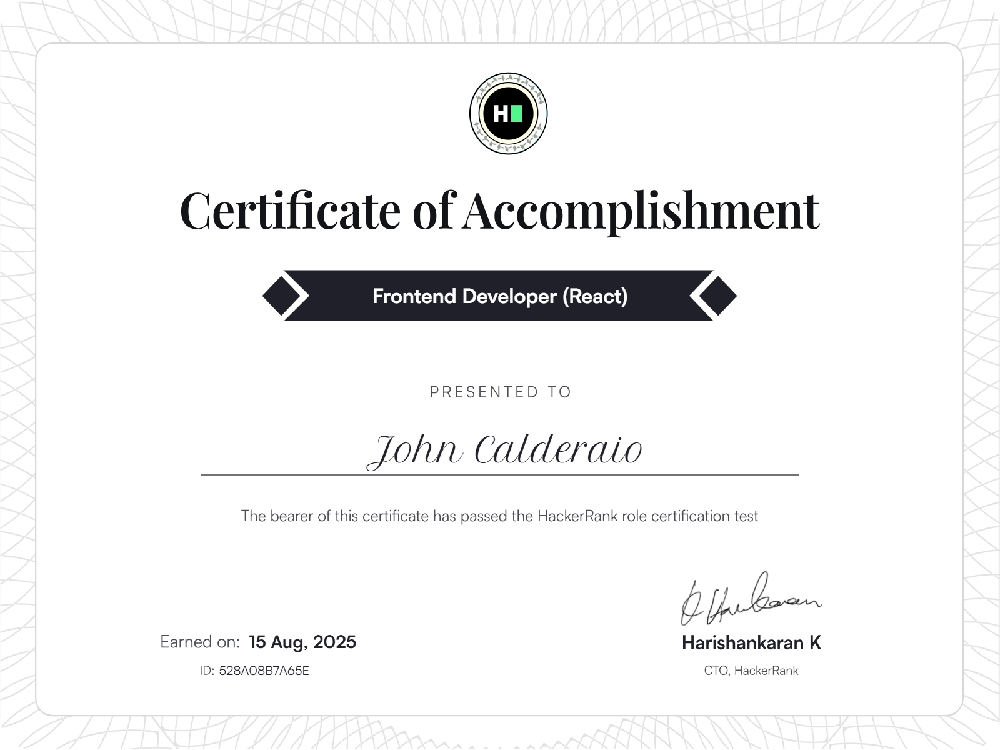
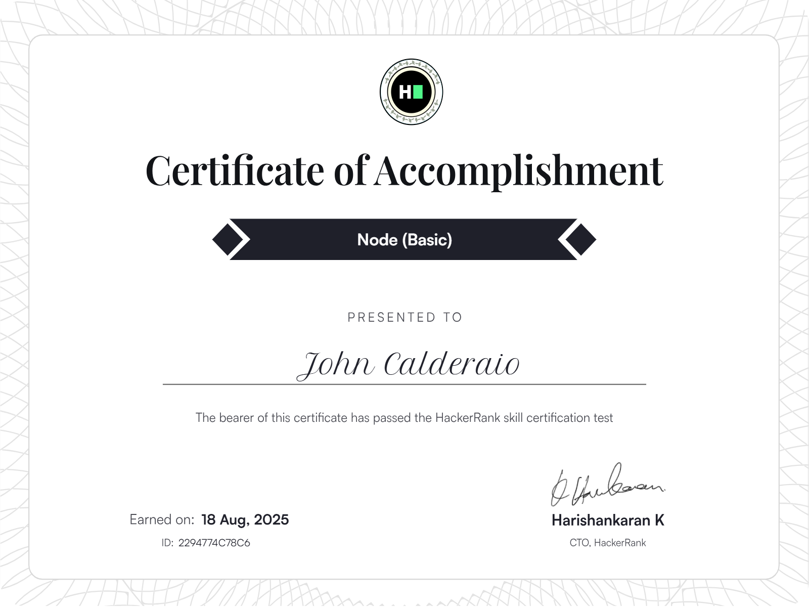

## Lead Developer

Highly skilled Senior TypeScript Developer with over 10 years of experience in designing, developing, and maintaining scalable web applications. Proficient in leveraging modern frameworks and libraries, including Angular, React, and Node.js, to deliver high-quality software solutions. Passionate about clean code, agile methodologies, and continuous improvement.

# React Certificate

# Node Certificate

<!--
**KingLion88/KingLion88** is a ✨ _special_ ✨ repository because its `README.md` (this file) appears on your GitHub profile.

Here are some ideas to get you started:

- 🔭 I’m currently working on ...
- 🌱 I’m currently learning ...
- 👯 I’m looking to collaborate on ...
- 🤔 I’m looking for help with ...
- 💬 Ask me about ...
- 📫 How to reach me: ...
- 😄 Pronouns: ...
- ⚡ Fun fact: ...
-->
